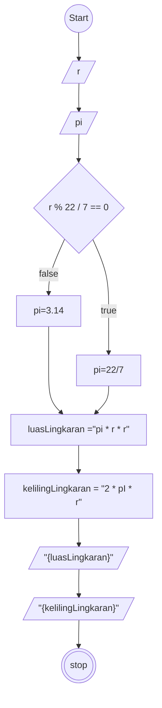

# Flowchart

## Flowchart algoritma

Membuat Flowchart berdasarkan alur program yang d buat

```mermaid
flowchart TD
a@{shape: circle, label: "Start"}
b@{shape: lean-r, label: "r" }
c@{shape: lean-r, label: "pi"}
d@{shape: rect, label: luasLingkaran ="pi * r * r"}
z@{shape: diamond, label : "r % 22 / 7 == 0"}
y@{shape: rect, label: "pi=22/7" }
x@{shape: rect, label: "pi=3.14"}
e@{shape: rect, label: kelilingLingkaran = "2 * pI * r"}
f@{shape: lean-r, label: '"{luasLingkaran}"'}
g@{shape: lean-r, label: '"{kelilingLingkaran}"'}
h@{shape: dbl-circ, label: "stop"}

a-->b-->c-->z--true-->y
z--false-->x
x-->d
y-->d
d-->e
e-->f
f-->g
g-->h
```
