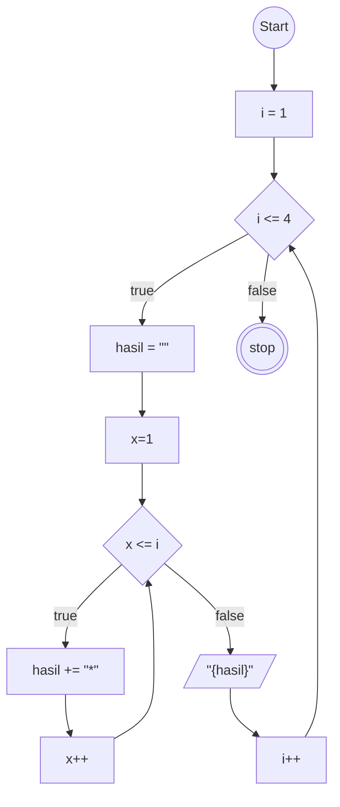

# javascript

## flowchart Segitiga nestead

```mermaid
flowchart TD

a@{shape: circle, label: "Start"}
b@{shape: rect, label: " i = 1 " }
c@{shape: diamond, label: "i <= 4"}
d@{shape: rect, label : 'hasil = ""'}
e@{shape: rect, label: "x=1"}
f@{shape: diamond, label: "x <= i"}
g@{shape: rect, label: 'hasil += "*"'}
h@{shape: rect, label: "x++"}
i@{shape: dbl-circ, label: "stop" }
j@{shape: lean-r, label : '"{hasil}"'}
k@{shape: rect, label: "i++"}


a-->b
b-->c
c--true-->d
d-->e
e-->f
f--true-->g
f--false-->j
j-->k
k-->c
h-->f
g-->h
c--false-->i
```
